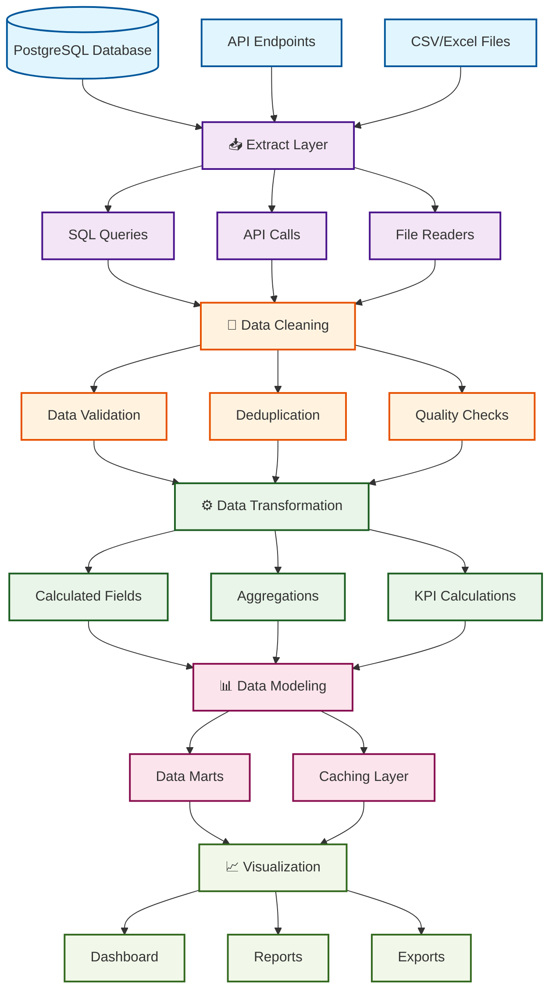

# Диаграмма конвейера обработки данных

Визуальное представление процесса ETL (Extract → Transform → Load) и аналитического конвейера данных.

## 🔄 Обзор конвейера

```
📊 Источники данных → 🔍 Извлечение → 🧹 Очистка → 📈 Моделирование → 📋 Визуализация
```

## 📈 Подробная схема конвейера



## 🏗 Архитектура по слоям

### 1. 📥 Extract Layer (Слой извлечения)

**Назначение**: Получение сырых данных из различных источников

#### Источники данных:

- **PostgreSQL Database** (основной источник)

  - Таблицы: customers, orders, order_items, products, suppliers
  - Подключение через psycopg2/SQLAlchemy
  - Прямые SQL запросы

- **API Endpoints** (дополнительные данные)

  - REST API для реального времени
  - WebSocket для live данных
  - Внешние интеграции

- **File Sources** (файлы данных)
  - CSV выгрузки
  - Excel отчеты
  - JSON конфигурации

#### Инструменты извлечения:

```javascript
// Frontend API Service
const dbService = DatabaseService.getInstance()
const data = await dbService.executeQuery(sqlQuery, params)
```

```python
# Python extraction script
import pandas as pd
import psycopg2

def extract_data(query, params):
    conn = psycopg2.connect(**DB_CONFIG)
    return pd.read_sql(query, conn, params=params)
```

#### Файлы:

- `sql/extract_*.sql` - Параметризованные запросы
- `src/services/database.ts` - API сервис
- `scripts/data_extraction.py` - Python скрипты

---

### 2. 🧹 Clean Layer (Слой очистки)

**Назначение**: Устранение проблем качества данных

#### Процессы очистки:

**Data Validation (Валидация данных)**

- Проверка типов данных
- Валидация форматов (email, телефоны, даты)
- Проверка диапазонов значений
- Контроль обязательных полей

**Deduplication (Удаление дубликатов)**

- Поиск дубликатов по ключевым полям
- Стратегии разрешения конфликтов
- Сохранение лучших записей

**Quality Checks (Проверки качества)**

- Проверка ссылочной целостности
- Выявление аномалий
- Статистический контроль

#### Инструменты очистки:

```sql
-- SQL скрипт очистки
DELETE FROM customers
WHERE id NOT IN (
    SELECT MIN(id)
    FROM customers
    GROUP BY email
);
```

```python
# Python очистка
def clean_duplicates(df, key_columns):
    return df.drop_duplicates(subset=key_columns, keep='first')

def validate_emails(df):
    mask = df['email'].str.contains('@', na=False)
    return df[mask]
```

#### Файлы:

- `scripts/data_cleaning.sql` - SQL очистка
- `scripts/data_cleaning_detailed.py` - Python очистка
- `scripts/data_cleaning_notebook.ipynb` - Jupyter анализ

---

### 3. ⚙️ Transform Layer (Слой трансформации)

**Назначение**: Преобразование и обогащение данных

#### Типы трансформаций:

**Calculated Fields (Расчетные поля)**

```sql
-- Расчет общей суммы заказа
(SELECT SUM(oi.quantity * oi.unit_price)
 FROM order_items oi
 WHERE oi.order_id = o.id) as total_amount

-- Статус запасов
CASE
    WHEN stock_quantity <= reorder_level THEN 'low_stock'
    WHEN stock_quantity = 0 THEN 'out_of_stock'
    ELSE 'in_stock'
END as stock_status
```

**Aggregations (Агрегации)**

```sql
-- Ежемесячная агрегация
SELECT
    DATE_TRUNC('month', order_date) as month,
    COUNT(*) as orders_count,
    SUM(total_amount) as revenue
FROM orders
GROUP BY DATE_TRUNC('month', order_date)
```

**KPI Calculations (Расчет KPI)**

```sql
-- AOV (средняя стоимость заказа)
SELECT
    SUM(total_amount) / COUNT(*) as aov
FROM orders
WHERE payment_status = 'paid'

-- Конверсия оплаты
SELECT
    COUNT(CASE WHEN payment_status = 'paid' THEN 1 END)::numeric /
    COUNT(*)::numeric * 100 as conversion_rate
FROM orders
```

#### Файлы:

- `docs/KPI_FORMULAS.md` - Формулы расчетов
- `sql/extract_kpi_metrics.sql` - KPI запросы
- `src/services/analyticsService.ts` - Бизнес-логика

---

### 4. 📊 Model Layer (Слой моделирования)

**Назначение**: Структурирование данных для анализа

#### Компоненты модели:

**Data Marts (Витрины данных)**

- Продажи и выручка
- Клиентская аналитика
- Товарная аналитика
- Операционные метрики

**Caching Layer (Слой кэширования)**

```javascript
// Кэширование в frontend сервисе
private cache = new Map<string, CacheEntry<any>>();

private getCachedData<T>(cacheKey: string): T | null {
    const entry = this.cache.get(cacheKey);
    if (!entry) return null;

    const now = Date.now();
    if (now - entry.timestamp > entry.ttl) {
        this.cache.delete(cacheKey);
        return null;
    }

    return entry.data as T;
}
```

**Calculated Views (Вычисляемые представления)**

```sql
-- Представление для метрик качества данных
CREATE VIEW data_quality_metrics AS
SELECT
    'customers' as table_name,
    COUNT(*) as total_rows,
    COUNT(CASE WHEN email IS NULL THEN 1 END) as missing_emails
FROM customers;
```

#### Файлы:

- `src/services/database.ts` - Кэширование API
- База данных views и materialized views

---

### 5. 📈 Visualization Layer (Слой визуализации)

**Назначение**: Представление данных пользователям

#### Компоненты визуализации:

**Dashboard (Дашборд)**

- Интерактивные виджеты
- Реальн��е время обновления
- Фильтрация и детализация

**Reports (Отчеты)**

- Статические отчеты
- Экспорт в PDF/Excel
- Автоматическая рассылка

**Export (Экспорт)**

- CSV/Excel выгрузки
- API endpoints
- Автоматизированные отчеты

#### Frontend компоненты:

```vue
<!-- Виджет статистики БД -->
<DatabaseStatsCards :stats="databaseStats" />

<!-- Виджет активности запросов -->
<QueryActivityWidget :activities="queryActivities" />

<!-- Виджет производительности -->
<DatabasePerformanceWidget :metrics="performanceMetrics" />
```

#### Файлы:

- `src/components/` - Vue компоненты
- `src/views/` - Страницы дашборда
- `src/services/` - API сервисы

---

## 🔄 Поток данных в реальном времени

### Последовательность обработки:

1. **User Request** → Frontend делает запрос к API
2. **API Gateway** → Backend получает запрос
3. **Cache Check** → Проверка кэша
4. **Database Query** → Выполнение SQL запроса
5. **Data Validation** → Проверка качества данных
6. **Business Logic** → Применение бизнес-правил
7. **Caching** → Сохранение в кэш
8. **Response** → Возврат данных на frontend
9. **Visualization** → Отображение в компонентах

### Временные характеристики:

- **API Response Time**: 200-500ms
- **Cache Hit**: 10-50ms
- **Database Query**: 100-2000ms
- **Large Aggregations**: 2-10s

---

## 📊 Мониторинг конвейера

### Ключевые метрики:

**Производительность**

- Время ответа API
- Частота попаданий в кэш
- Время выполнения SQL запросов
- Загрузка системы

**Качество данных**

- Процент успешных операций
- Количество ошибок валидации
- Процент полноты данных
- Количество дубликатов

**Доступность**

- Время работы системы (uptime)
- Статус подключения к БД
- Доступность внешних API
- Статус кэширования

### Алерты и уведомления:

```javascript
// Мониторинг в реальном времени
if (apiResponseTime > 5000) {
  alert('Slow API response detected')
}

if (cacheHitRate < 0.8) {
  alert('Low cache hit rate')
}

if (databaseConnectionFailed) {
  alert('Database connection failed')
}
```

---

## 🔧 Инструменты и технологии

### Backend:

- **Database**: PostgreSQL 14+
- **API**: Express.js + Node.js
- **Connection Pool**: pg-pool
- **Caching**: In-memory cache
- **Monitoring**: Morgan + Custom logging

### Frontend:

- **Framework**: Vue.js 3 + TypeScript
- **Styling**: TailwindCSS
- **Build**: Vite
- **HTTP Client**: Fetch API
- **State Management**: Vue Composition API

### Data Processing:

- **SQL**: PostgreSQL native functions
- **Python**: pandas, psycopg2, matplotlib
- **JavaScript**: Native array methods, lodash
- **Notebooks**: Jupyter for analysis

### DevOps:

- **Version Control**: Git
- **Environment**: Docker (cloud-based)
- **Process Management**: npm scripts
- **Logging**: Console + File logging

---

## 📋 Планы развития

### Краткосрочные улучшения (1-3 месяца):

1. **Real-time Updates** - WebSocket для обновлений в реальном времени
2. **Advanced Caching** - Redis для распределенного кэширова��ия
3. **Data Validation** - Более строгие правила валидации
4. **Performance Optimization** - Оптимизация медленных запросов

### Среднесрочные улучшения (3-6 месяцев):

1. **Machine Learning** - Прогнозирование и anomaly detection
2. **Data Lake** - Хранилище для больших объемов данных
3. **Stream Processing** - Обработка данных в реальном времени
4. **Advanced Analytics** - Более сложные аналитические модели

### Долгосрочные планы (6-12 месяцев):

1. **Microservices Architecture** - Разделение на микросервисы
2. **Cloud Migration** - Переход в облако
3. **Data Governance** - Управление качеством данных
4. **Self-Service Analytics** - Инструменты для пользователей

---

## 📝 Заключение

Данный конвейер обработки данных обеспечивает:

✅ **Надежность** - Устойчивость к сбоям и ошибкам  
✅ **Масштабируемость** - Поддержка роста объемов данных  
✅ **Производительность** - Быстрый отклик системы  
✅ **Качество** - Высокое качество обработанных данных  
✅ **Мониторинг** - Полная видимость процессов

Конвейер построен по принципам современной архитектуры данных и готов к развитию в соответствии с потребностями бизнеса.

---

_Диаграмма обновлена: 2024-08-22_  
_Версия: 1.0_  
_Ответственный: DataBoard Team_
